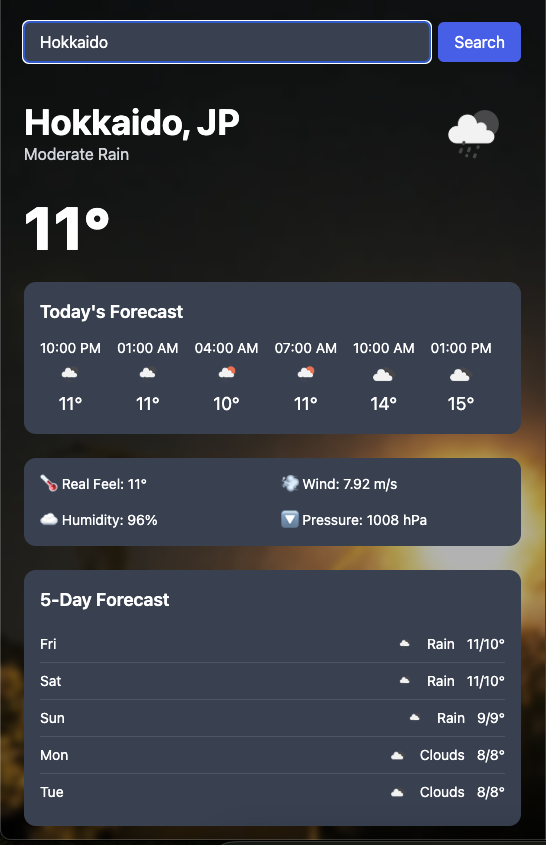

# 🌦️ Weather Dashboard React

A sleek and responsive weather dashboard built with **React**, **Vite**, and **Tailwind CSS**, featuring live background videos based on current weather conditions using the OpenWeatherMap API.

## 📸 Preview



> Background changes dynamically (e.g. clear, rain, thunderstorm)

## 🌐 Live Demo

👉 https://weather-dashboard-react-arrieaunps-projects.vercel.app/

---

## 🚀 Features

- 🔍 **City-based search** with real-time weather data
- 🎥 **Dynamic background video** based on weather icon (via Cloudinary)
- 📅 Hourly & 5-day forecasts
- 🌬️ Wind speed, humidity, pressure display
- 📱 Mobile responsive UI

---

## 🛠️ Tech Stack

- ⚛️ React + Vite
- 💨 Tailwind CSS
- 🌤️ OpenWeatherMap API
- ☁️ Cloudinary (for video CDN)
- 🔁 Vercel (for deployment)

---

## 📦 Installation

```bash
git clone https://github.com/arrieaunp/weather-dashboard-react.git
cd weather-dashboard-react
npm install
npm run dev
```

---

## ⚙️ Environment Variables
Create a .env file at the root:
```bash
VITE_WEATHER_API_KEY=your_openweathermap_api_key
```

